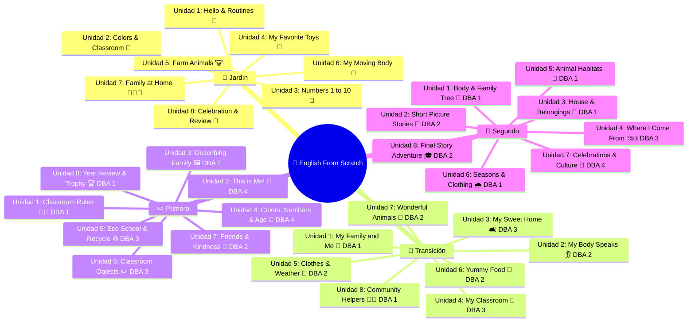

# 🌟 English From Scratch 🇨🇴 🚀📚🎈

<p align="center">
  
  
  
  
  
  
  
</p>

<p align="center">
  <b> Plataforma Educativa Interactiva de Inglés para Preescolar y Primaria en Colombia 🇨🇴 </b><br>
  <i>100% Alineada a los Derechos Básicos de Aprendizaje (DBA) del Ministerio de Educación Nacional (MEN)</i>
</p>

<p align="center">
  
  
  
  
  
  
  
</p>

---

## 📑 Tabla de Contenidos Mágica 🗺️✨

- [🌈 ¿Qué es English From Scratch?](#-qué-es-english-from-scratch)
- [💎 Superpoderes de la Plataforma](#-superpoderes-de-la-plataforma-)
- [🎨 Diseño & Estética Claymorphism](#-diseño--estética-claymorphism-)
- [📚 Currículo Oficial DBA MEN (32 Unidades)](#-currículo-oficial-dba-men-32-unidades-)
- [🎧 Módulos Interactivos de Aprendizaje](#-módulos-interactivos-de-aprendizaje-)
  - [📽️ Diapositivas Interactivas de Clase (DBADeck)](#️-diapositivas-interactivas-de-clase-dbadeck)
  - [🎧 Laboratorio de Listening & Canciones](#-laboratorio-de-listening--canciones)
  - [✍️ Taller de Writing & Fichas Guiadas](#️-taller-de-writing--fichas-guiadas)
  - [🎬 Videoteca Educativa Curada](#-videoteca-educativa-curada)
  - [🏠 Homework para Resolver en Familia](#-homework-para-resolver-en-familia)
- [👥 Experiencia por Roles](#-experiencia-por-roles-)
  - [👩‍🏫 Panel del Docente](#-panel-del-docente)
  - [👑 Panel del Administrador](#-panel-del-administrador)
- [⚡ Arquitectura y Ultra Rendimiento](#-arquitectura-y-ultra-rendimiento-)
- [🛠️ Stack Tecnológico Completo](#️-stack-tecnológico-completo-)
- [🚀 Puesta en Marcha Rápida (Local)](#-puesta-en-marcha-rápida-local-)
- [🔐 Accesos y Credenciales de Prueba](#-accesos-y-credenciales-de-prueba-)
- [🌐 Catálogo de Endpoints REST API](#-catálogo-de-endpoints-rest-api-)
- [🧪 Suite de Pruebas Automatizadas](#-suite-de-pruebas-automatizadas-)
- [📁 Estructura del Repositorio](#-estructura-del-repositorio-)
- [🤝 Contribución y Licencia](#-contribución-y-licencia-)

---

## 🌈 ¿Qué es English From Scratch? 🇨🇴🎒

**English From Scratch** es la plataforma institucional interactiva concebida para transformar la enseñanza del inglés en los colegios de Colombia 🇨🇴.

💡 **El Problema en las Aulas:**  
Los docentes de preescolar y básica primaria frecuentemente carecen de material digital interactivo alineado a la normativa colombiana, o dependen de herramientas extranjeras desconectadas del contexto escolar, lentas o que requieren suscripciones costosas.

🎯 **Nuestra Solución:**  
Una herramienta pedagógica lista para proyector o Smart TV escolar 📺 que permite al docente impartir lecciones inmersivas con pronunciación nativa, canciones, videos pedagógicos, minijuegos y tareas familiares, mientras la institución monitorea en tiempo real el avance por grado y por profesor 📊.

```
                  🏫 COLEGIO / INSTITUCIÓN EDUCATIVA
                                  │
         ┌────────────────────────┴────────────────────────┐
         ▼                                                 ▼
  👑 ADMINISTRADOR                                  👩‍🏫 DOCENTE
  • Gestión de Profesores                           • Grados Asignados
  • Métricas Ponderadas                             • Proyección en Aula
  • Control Global de Avance                        • Registro de Progreso
         │                                                 │
         └────────────────────────┬────────────────────────┘
                                  ▼
                   👶 ESTUDIANTES EN EL AULA
        🧸 Jardín  ──  🎒 Transición  ──  ✏️ 1°  ──  🎨 2°
         (Audio 🔊 + Videos 🎬 + Juegos 🧩 + Tareas 🏠)
```

---

## 💎 Superpoderes de la Plataforma 🚀⭐

- 🧸 **Cobertura 100% DBA Colombia:** 32 unidades didácticas distribuidas en **Jardín**, **Transición**, **Primero** y **Segundo**.
- 🔊 **Voz Nativa Amigable (Speech Synthesis):** Pronunciación clara y pausada con entonación cariñosa para niños.
- 🎵 **Refuerzo Positivo con Chime Polifónico:** Cuando los niños aciertan, suena una melodía mágica celebratoria acompañada del audio *"Nice job! 🌟"*.
- 🎬 **Videos de YouTube Integrados:** Canciones infantiles oficiales embebidas dentro de las diapositivas de clase y en videoteca.
- 🖼️ **162 Ilustraciones Vectoriales Offline (OpenMoji):** Iconografía pedagógica de alta resolución que carga directo desde el servidor local, sin depender de conexiones lentas en las escuelas.
- 🏠 **Homework en Familia:** Desafíos prácticos al final de cada unidad para involucrar a los padres de familia en casa.
- 🔒 **Sistema de "Recordarme" Inteligente:** Guarda el correo del docente en el dispositivo para inicios de sesión en un clic.
- 📊 **Métricas Ponderadas por Docente:** El administrador visualiza métricas de cobertura y desempeño calculadas según los docentes activos en cada grado.
- ⚡ **Rendimiento Ultrarrápido:** Cargas instantáneas en 0 ms, bundle de 71 kB y scroll fluido a 60 FPS.

---

## 🎨 Diseño & Estética Claymorphism 🧸🎨

La plataforma utiliza una estética visual basada en **Claymorphism Infantil** 🧸: elementos suaves, tridimensionales, acolchados y con sombras reconfortantes que imitan la plastilina y los bloques de construcción infantiles:

```
    ╔══════════════════════════════════════════════════════╗
    ║   ╭────────────╮   ╭────────────╮   ╭────────────╮   ║
    ║   │  🧸 JARDÍN │   │🎒TRANSICIÓN│   │ ✏️ PRIMERO  │   ║
    ║   ╰────────────╯   ╰────────────╯   ╰────────────╯   ║
    ║                                                      ║
    ║   ✨ Botones con relieve táctil 3D                   ║
    ║   🌈 Paleta armónica: Coral, Esmeralda, Cielo, Oro  ║
    ║   🌙 Modo Oscuro y Modo Claro de alta legibilidad   ║
    ║   🎈 Animaciones flotantes suaves y fluidas          ║
    ╚══════════════════════════════════════════════════════╝
```

### 🎨 Paleta de Identidad
- 🌊 **Sky Blue (`#38BDF8`):** Serenidad, confianza y concentración escolar.
- 🌿 **Emerald Green (`#10B981`):** Aciertos, progreso y naturaleza.
- ☀️ **Sunny Yellow (`#F59E0B`):** Energía, estrellas de recompensa y entusiasmo.
- 🌸 **Coral Pink (`#F43F5E`):** Afecto, calidez y botones destacados de acción.
- 🔮 **Royal Purple (`#8B5CF6`):** Creatividad, imaginación y magia didáctica.

---

## 📚 Currículo Oficial DBA MEN (32 Unidades) 📖🇨🇴

El currículo institucional está dividido en 4 periodos académicos por año escolar (2 unidades por periodo):



---

## 🎧 Módulos Interactivos de Aprendizaje 🧩💡

### 📽️ Diapositivas Interactivas de Clase (DBADeck)
- **32 Decks Completos:** Diseñados específicamente para pantallas grandes y videoproyectores.
- **Botón de Escucha Instantánea:** Cada palabra clave tiene un botón de audio 🔊 que vocaliza con pronunciación infantil nativa.
- **Videos Embebidos:** Canciones temáticas de YouTube directamente en la diapositiva sin salir a publicidad exterior.
- **Retos Evaluativos:** Preguntas de selección múltiple con feedback sonoro y visual inmediato.
- **Pantalla de Celebración Final:** Lluvia de confeti 🎉 y guardado automático en base de datos al 100% de la lección.

### 🎧 Laboratorio de Listening & Canciones
- **32 Actividades Auditivas (8 por grado):**
  - Identificación de objetos y números por comando de voz.
  - Discriminación fonética de animales, colores y partes del cuerpo.
  - Botón de repetición cuantas veces sea necesario para el ritmo de cada niño.
  - Efecto de audio chime *"Nice job! 🌟"* al seleccionar la respuesta correcta.

### ✍️ Taller de Writing & Fichas Guiadas
- **24 Actividades Estructuradas (6 por grado):**
  - Ejercicios de rellenar espacios, ordenamiento de oraciones y transcripción de vocabulario.
  - **Autovalidación en tiempo real:** Detecta mayúsculas, minúsculas y espacios con tolerancia didáctica.
  - Lectura en voz alta de las instrucciones para apoyar a los niños que están aprendiendo a leer.

### 🎬 Videoteca Educativa Curada
- **32 Videos Musicales Seleccionados:**
  - Canales certificados mundialmente: *Super Simple Songs, The Singing Walrus, Maple Leaf Learning, The Kiboomers*.
  - Clasificados por grado escolar y temática de la semana.
  - Reproducción responsiva optimizada para tablets y laptops de clase.

### 🏠 Homework para Resolver en Familia
- **Misión Semanal:** Retos como dibujar la mascota favorita, buscar objetos de colores en la cocina o cantar el saludo en inglés a los abuelos.
- Fomenta la participación activa de los padres sin sobrecargar a los niños con tareas tediosas.

---

## 👥 Experiencia por Roles 🎭🔐

### 👩‍🏫 Panel del Docente (`/docente`)
- 📌 **Mis Grados:** Acceso exclusivo a los grados asignados por la rectoría o coordinación.
- 📈 **Progreso en Vivo:** Barra de avance porcentual por cada unidad temática completada.
- 🚀 **Lanzador de Clases:** Un solo clic para proyectar la lección del día en el televisor del aula.
- 🎯 **Acceso Directo:** Pestañas dedicadas para Diapositivas, Listening, Writing y Videos.

### 👑 Panel del Administrador (`/admin`)
- 👥 **Directorio de Docentes:** Alta de nuevos profesores, edición de datos y asignación de múltiples grados escolares.
- 🔑 **Restablecimiento de Claves:** Cambio seguro de credenciales con validación alfanumérica.
- 📊 **Métricas Institucionales Ponderadas:** Algoritmo que calcula el avance global considerando el número de docentes asignados a cada grado escolar.
- ⚡ **Acciones Rápidas:** Activar/desactivar cuentas con un solo switch sin eliminar historiales.

---

## ⚡ Arquitectura y Ultra Rendimiento 🚀🏎️

```
┌─────────────────────────────────────────────────────────────┐
│                    NAVEGADOR CLIENTE (SPA)                 │
│  React 18 + Vite 8 + Tailwind CSS + Web Audio API + TTS    │
└──────────────────────────────┬──────────────────────────────┘
                               │ HTTP / JSON (Axios + JWT)
                               ▼
┌─────────────────────────────────────────────────────────────┐
│                 BACKEND API (Django 5.2 REST)               │
│  SimpleJWT Auth + Views Pedagógicas + CORS + Gunicorn       │
└──────────────────────────────┬──────────────────────────────┘
                               │ TCP 3306 (ORM Queries)
                               ▼
┌─────────────────────────────────────────────────────────────┐
│                  BASE DE DATOS (MySQL 8.0)                  │
│  Usuarios, Grados, Unidades DBA, Progreso Docente           │
└─────────────────────────────────────────────────────────────┘
```

| Métrica de Rendimiento ⚡ | Antes 🐢 | Ahora con English From Scratch 🚀 |
| --- | --- | --- |
| 📦 **Tamaño de Bundle Inicial** | ~379 kB (monolítico) | **71 kB (81% de reducción con React.lazy)** ⚡ |
| 💨 **Tiempo de Transición de Rutas** | ~400 ms (recarga completa) | **< 16 ms (client-side routing instantáneo)** ⚡ |
| 🏎️ **Fluidez de Scroll en Pantalla** | Lag con filtros SVG | **60 FPS constantes con aceleración GPU** 🎮 |
| 🔄 **Rehidratación de Sesión** | Pantalla blanca visible | **0 ms con almacenamiento optimista en caché** ⚡ |
| 🖼️ **Carga de Ilustraciones** | Fallos por conectividad externa | **100% Offline con 162 OpenMoji vectoriales** 🛡️ |

---

## 🛠️ Stack Tecnológico Completo 💻🧰

### 🎨 Frontend
- **⚛️ React 18.3:** Biblioteca declarativa para interfaces reactivas.
- **⚡ Vite 8.0:** Servidor de desarrollo con Hot Module Replacement (HMR) instantáneo.
- **🎨 Tailwind CSS:** Sistema de diseño atómico y componentes Claymorphism.
- **🪄 Lucide React:** Iconografía vectorial moderna y liviana.
- **🔊 Web Audio API:** Síntesis de sonido estéreo y campanadas polifónicas de premio.
- **🧪 Vitest & Testing Library:** Pruebas automatizadas de componentes e integración.

### ⚙️ Backend & Base de Datos
- **🐍 Python 3.12:** Lenguaje base para servicios de alto rendimiento.
- **🎯 Django 5.2:** Framework web robusto y seguro.
- **🌐 Django REST Framework (DRF):** Endpoints JSON estandarizados.
- **🔑 SimpleJWT:** Tokens criptográficos seguros de acceso y renovación.
- **🐬 MySQL 8.0:** Motor de base de datos relacional para analítica escolar.
- **🐳 Docker & Docker Compose:** Entorno de contenedores reproducible en cualquier equipo.

---

## 🚀 Puesta en Marcha Rápida (Local) 🏁🐳

### 📋 Prerrequisitos
- 🐳 **Docker Engine 24+ & Docker Compose**
- 🐍 **Python 3.10+** (para inicialización local)

### ⚡ Paso a Paso en 3 Minutos

1. **Clonar el proyecto:**
   ```bash
   git clone https://github.com/JaredBautist/ENGLISH-ABC.git
   cd ENGLISH-ABC
   ```

2. **Generar entorno seguro y secretos locales:**
   ```bash
   python scripts/init_local.py
   ```

3. **Construir y levantar la flota de contenedores:**
   ```bash
   docker compose up --build -d --wait
   ```

4. **Sembrar el currículo oficial DBA (idempotente):**
   ```bash
   docker compose exec -T backend python manage.py seed_dba_curriculum
   ```

5. **¡Listo! Abre tu navegador:**
   - 🌐 **Plataforma Web:** [http://localhost:5173](http://localhost:5173)
   - 📡 **Documentación Swagger:** [http://localhost:8000/api/docs/](http://localhost:8000/api/docs/)

---

## 🔐 Accesos y Credenciales de Prueba 🔑📋

| Rol 👤 | Correo 📧 | Contraseña 🔑 | Grados / Permisos 🎯 |
| --- | --- | --- | --- |
| 👑 **Super Administrador** | `admin@englishnow.local` | `Admin1234*` | Acceso total a `/admin` y gestión institucional |
| 👩‍🏫 **Docente Preescolar** | `docente1@englishnow.local` | `Docente1234*` | Grados: **Jardín 🧸** y **Transición 🎒** |
| 👨‍🏫 **Docente Primaria** | `docente2@englishnow.local` | `Docente1234*` | Grados: **1° Primaria ✏️** y **2° Primaria 🎨** |

> 💡 **Tip:** En la pantalla de login puedes marcar la casilla **"Recordarme" 🔒** para que la plataforma recuerde automáticamente tu correo electrónico en ese equipo.

---

## 🌐 Catálogo de Endpoints REST API 📡🔌

```http
### 🔑 Autenticación & Sesión
POST   /api/auth/token/              -> Iniciar sesión con JWT (retorna access y refresh)
POST   /api/auth/token/refresh/      -> Renovar token de acceso caducado
GET    /api/auth/me/                 -> Obtener datos del usuario en sesión

### 👩‍🏫 Espacio Docente
GET    /api/grades/                  -> Listar grados habilitados para el docente
GET    /api/modules/?grade=<code>    -> Obtener las 8 unidades DBA del grado
GET    /api/teachers/me/summary/     -> Métricas personales de progreso
GET    /api/teachers/me/progress/    -> Estado de avance por módulo
POST   /api/teachers/me/progress/    -> Guardar nuevo porcentaje de lección completada

### 👑 Gestión Administrativa
GET    /api/admin/overview/          -> KPIs institucionales globales ponderados
GET    /api/admin/teachers/          -> Directorio completo de docentes y asignaciones
POST   /api/admin/teachers/          -> Registrar nuevo docente en el colegio
PATCH  /api/admin/teachers/<id>/     -> Modificar datos, grados o resetear contraseña
```

---

## 🧪 Suite de Pruebas Automatizadas 🛡️✅

### 🧪 Pruebas Unitarias & Integración Frontend
```bash
# Ejecutar las 8 pruebas de componentes con Vitest:
docker compose exec -T frontend npm test -- --run
```

### 🧪 Pruebas Backend & Integridad MySQL
```bash
# Ejecutar suite de pruebas en Django:
docker compose exec -T backend python manage.py test

# O ejecutar el script de verificación automatizado:
python scripts/test_mysql.py
```

### 📦 Verificación de Compilación de Producción
```bash
# Validar que no hay errores de TypeScript/Rollup:
docker compose exec -T frontend npm run build
```

---

## 📁 Estructura del Repositorio 📂🏗️

```text
├── 🐍 backend/                   # API Django REST Framework
│   ├── apps/
│   │   ├── accounts/             # 👤 Autenticación, JWT, modelos de usuario y roles
│   │   ├── learning/             # 📚 Modelos: Grade, Module, DBA, TeacherGrade, Progress
│   │   └── api/                  # 🌐 Serializadores y controladores de endpoints
│   ├── config/                   # ⚙️ Settings, URLs y middleware CORS
│   ├── manage.py
│   └── Dockerfile
├── ⚛️ frontend/                  # Aplicación de una sola página (SPA) React
│   ├── public/
│   │   └── openmoji/             # 🖼️ 162 Ilustraciones vectoriales locales SVG
│   ├── src/
│   │   ├── components/           # 📽️ DBADeck, TeacherWorkspace, AdminPanel, VideoPlayer
│   │   ├── features/auth/        # 🔐 AuthContext, RememberMe, TokenStorage, Login hooks
│   │   ├── data/                 # 📖 grados.js, unitSlides.js (32 unidades), material.js
│   │   ├── shared/               # 🔊 friendlySpeech (TTS), modales, alertas y botones Clay
│   │   └── utils/                # 📡 apiFetch con autorefresco de tokens JWT
│   ├── index.html
│   ├── vite.config.js
│   └── vitest.config.js
├── 🛠️ scripts/                   # Automatizaciones de inicialización, tests y curación
├── 🐳 docker-compose.yml         # Orquestación de Frontend, Backend y Base de Datos
├── 🚀 DEPLOY_VERCEL.md           # Guía completa para despliegue en la nube
└── 🌟 README.md                  # Este archivo de documentación oficial
```

---

## 🤝 Contribución y Licencia 📜🎈

Este proyecto ha sido desarrollado con amor y dedicación para potenciar la educación pública y privada de los niños en Colombia 🇨🇴.

- 🌟 Si este proyecto te resulta inspirador o útil, ¡déjanos una estrella en GitHub! ⭐
- 💡 ¿Tienes sugerencias didácticas o nuevas canciones? ¡Los Pull Requests son bienvenidos! 🎈

<p align="center">
  <b>Hecho con ❤️, plastilina digital 🧸 y mucho café ☕ para la niñez colombiana 🇨🇴</b><br>
  <i>English From Scratch — Innovación en el Aula Escolar</i>
</p>
